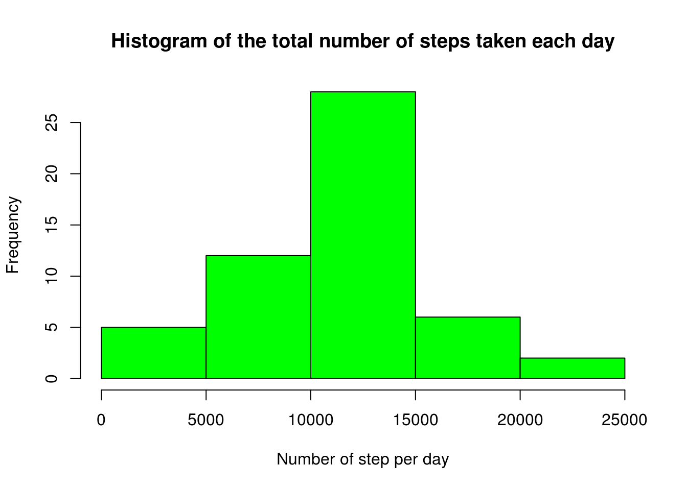
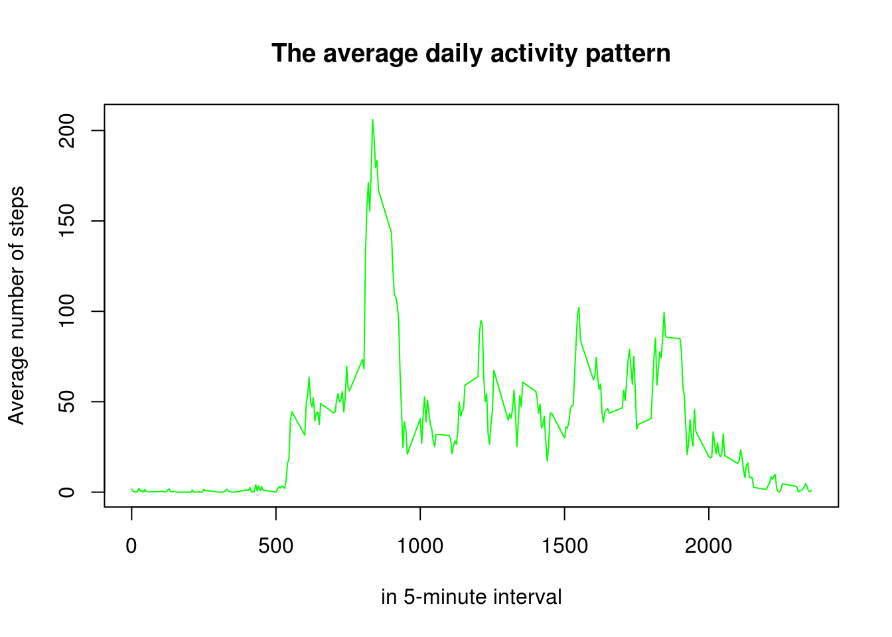
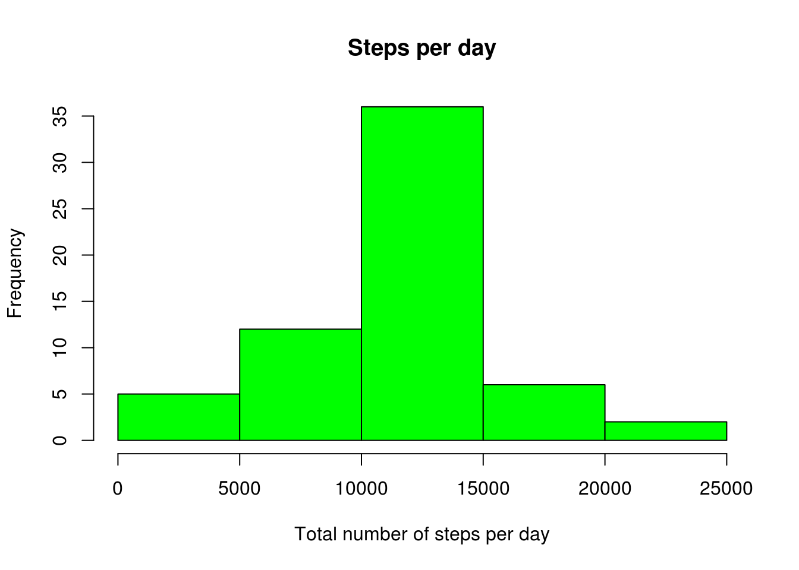
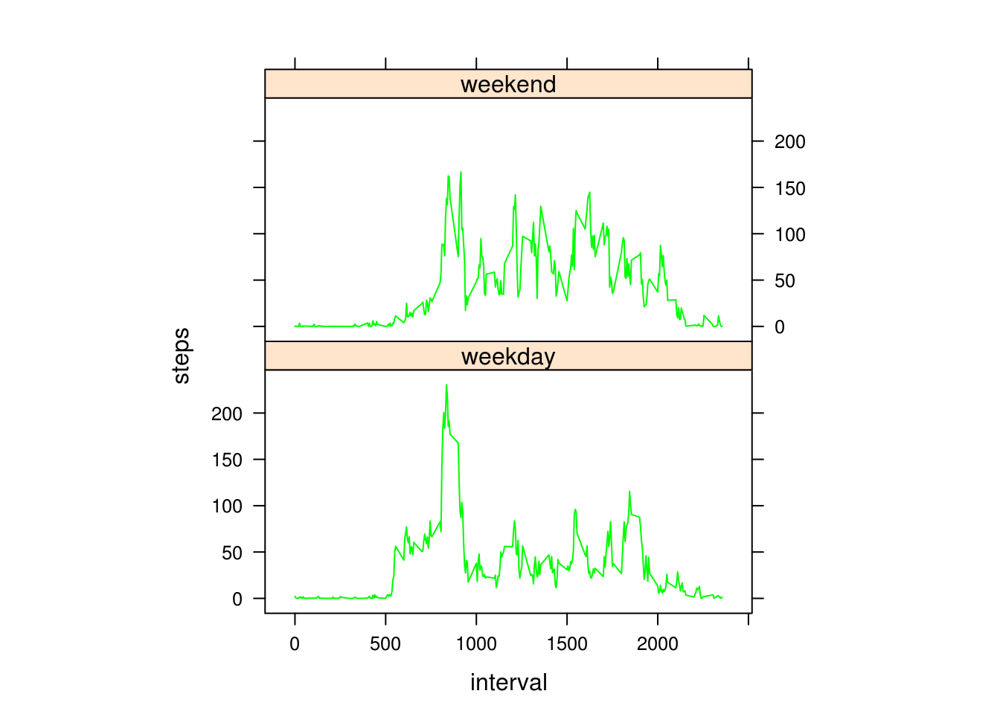

## * Load and preproces the activity data


```r
activityDataOrginal <- read.csv("activity.csv", header=TRUE)
activityData <- activityDataOrginal[which(activityDataOrginal$steps != "NA"), ]
```

### * Histogram of the total number of steps taken each day

```r
total_steps <- aggregate(steps ~ date, activityData, sum)
hist(total_steps$steps, main="Histogram of the total number of steps taken each day", xlab = "Number of step per day", col="green")
```



### * Calculate and report the mean and median of the total number of steps taken per day


```r
mean(total_steps$steps)
```

```
## [1] 10766.19
```

```r
median(total_steps$steps)
```

```
## [1] 10765
```

### * What is the average daily activity pattern?
#### Make a time series plot (i.e. type = "l") of the 5-minute interval (x-axis) and the average number of steps taken, averaged across all days (y-axis)


```r
stepInterval<-aggregate(steps~interval,data=activityData,mean,na.rm=TRUE)
plot(stepInterval$interval,stepInterval$steps, type="l", 
     col="green",
     ylab="Average number of steps",
     xlab="in 5-minute interval", 
     main="The average daily activity pattern")
```




### * Which 5-minute interval, on average across all the days in the dataset, contains the maximum number of steps?

```r
stepInterval[which.max(stepInterval$steps),]$interval
```

```
## [1] 835
```

```r
colnames(stepInterval)[2] <- "numberOfSteps"
```

### * Imputing missing values

#### Calculate and report the total number of missing values in the dataset (i.e. the total number of rows with NAs)

```r
total_NA <- sum(is.na(activityDataOrginal$steps))
print(total_NA)
```

```
## [1] 2304
```

Devise a strategy for filling in all of the missing values in the dataset. The strategy does not need to be sophisticated.  
For example, you could use the mean/median for that day, or the mean for that 5-minute interval, etc.
Create a new dataset that is equal to the original dataset but with the missing data filled in.
library(lattice)

```r
# Fill NA's with average for that 5-min interval
newDataSet <- arrange(join(activityDataOrginal, stepInterval), interval)
```

```
## Joining by: interval
```

```r
newDataSet$steps[is.na(newDataSet$steps)] <- newDataSet$numberOfSteps[is.na(newDataSet$steps)]
newStepDataSet <- ddply(newDataSet, .(date), summarise, steps=sum(steps))
# create histogram
hist(newStepDataSet$steps, main="Steps per day", 
     xlab="Total number of steps per day", col="green")
```



```r
# what are the mean and median of the new Data set
mean(newStepDataSet$steps)
```

```
## [1] 10766.19
```

```r
median(newStepDataSet$steps)
```

```
## [1] 10766.19
```

Q:      What is the impact of imputing missing data on the estimates of the total daily number of steps?

A:      The mean is the same as before imputing the missing data.This is because we replaced it with the 5-min interval.  
        The median is a different because we replaced the missing values with new values. 

### Are there differences in activity patterns between weekdays and weekends?


* Create a new factor variable in the dataset with two levels – “weekday” and “weekend” indicating whether a given date is a weekday or weekend day.

```r
newDataSet$day=ifelse(as.POSIXlt(as.Date(newDataSet$date))$wday%%6==0,"weekend","weekday")
newDataSet$day=factor(newDataSet$day,levels=c("weekday","weekend"))
differenceInDays=aggregate(steps~interval+day,newDataSet,mean)
xyplot(steps~interval|factor(day),data=differenceInDays,type="l",aspect=1/2, col="green")
```



We can see difference between activity patterns between weekdays and weekends
